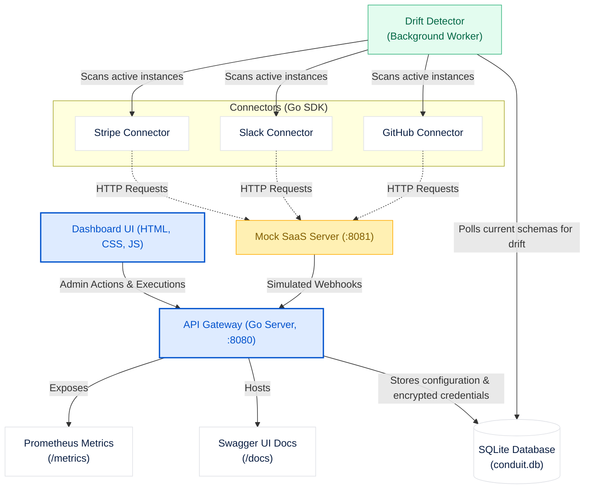

# Conduit — SaaS Integration Gateway

Conduit is a lightweight, dynamic SaaS integration gateway framework built in Go. It enables developers to build, distribute, configure, and monitor connector instances for popular external services (such as GitHub, Slack, and Stripe) through a single unified interface.

Conduit handles the heavy lifting of:
- **Authentication**: Managing API keys and standardizing OAuth 2.0 redirection & token refresh flows.
- **Secure Storage**: Keeping configuration credentials encrypted at rest in a local SQLite database (using AES-GCM encryption).
- **Drift Detection**: Running a periodic schema drift detector worker that proactively checks for shifts in API shapes or payload field types.
- **Observability**: Exposing real-time gateway performance metrics, OAuth token refreshes, and endpoint error rates via Prometheus.
- **Auto-generated API Docs**: Dynamically generating and serving an OpenAPI 3.x specification and hosting an interactive Swagger UI API explorer.

---

## 🏗 Project Architecture

The diagram below illustrates how the components of Conduit communicate:



### Component Roles

1. **Dashboard UI**: A Single Page Application (SPA) located in `/ui/` styled according to the Atlassian Design Guidelines. It lets developers explore registered connectors, perform OAuth installations, trigger API endpoint executions manually, and monitor system drift logs.
2. **API Gateway (`gateway` package)**: The core server engine. It sets up HTTP routing, processes installations, decrypts credentials, invokes connectors, handles OAuth callbacks, and dispatches incoming webhook payloads.
3. **Connectors (`connectors` package)**: Modules implementing the `sdk.Connector` interface. They describe configuration requirements, request scopes, available API endpoints, and input/output payload schemas.
4. **Drift Detector**: A background worker thread running every 30 seconds that checks whether the shape of data in the connected third-party APIs has drifted from what was captured during initial configuration.
5. **Mock Server (`mock` package)**: A local mock SaaS provider. It simplifies local development by simulating OAuth credential exchanges, mock API endpoints (e.g., creating GitHub issues), and periodic webhook payloads.

---

## 📁 Repository Layout

```text
conduit-go/
├── cmd/
│   ├── conduit-scaffold/ # Code generator tool creating Go connector skeletons from OpenAPI specs
│   └── gateway/          # Main entrypoint running the Conduit API Gateway & Mock Provider
├── connectors/           # Connector implementations
│   ├── github/           # GitHub integration logic
│   ├── slack/            # Slack integration logic
│   └── stripe/           # Stripe integration logic
├── gateway/              # Gateway logic (DB integration, router, drift detector, openapi generation)
├── mock/                 # Built-in Mock SaaS server providing mock endpoints & webhook dispatchers
├── sdk/                  # Conduit SDK defining interfaces, structs, and credentials models
└── ui/                   # Frontend SPA files (index.html, app.css, app.js)
```

---

## ⚡ Getting Started

### Prerequisites

Ensure you have **Go 1.21+** installed.

### 1. Run the API Gateway and Mock Server

Start the integrated gateway and mock SaaS provider with the following command:

```bash
go run cmd/gateway/main.go
```

By default, the server will output startup logs:
- **Dashboard UI**: [http://localhost:8080/ui/](http://localhost:8080/ui/)
- **Interactive OpenAPI Documentation**: [http://localhost:8080/docs](http://localhost:8080/docs)
- **Raw OpenAPI Spec**: [http://localhost:8080/openapi.json](http://localhost:8080/openapi.json)
- **Prometheus Metrics**: [http://localhost:8080/metrics](http://localhost:8080/metrics)
- **Mock SaaS Server**: Running on `localhost:8081`

### 2. Configure Encryption Key (Production)

Conduit automatically encrypts OAuth tokens and API keys using AES-256-GCM. During local development, it falls back to a default key. For production, set the environment variable:

```bash
export CONDUIT_ENCRYPTION_KEY="your-32-byte-long-secret-key-here"
```

---

## 🛠 Command Line Flags

You can customize the execution of the main binary:

- `-addr`: Port and IP interface for the Gateway (default `:8080`).
- `-db`: Path to the SQLite database file (default `./conduit.db`).
- `-mock`: Set to `true` (default) to start the built-in mock SaaS server, or `false` to attempt connection to real SaaS APIs.
- `-mock-addr`: Address for the mock server to bind to (default `:8081`).
- `-webhook-secret`: Secret key used for signing and verifying incoming webhook signatures.

---

## 🧩 Developing Custom Connectors

To create a new integration, you can use the built-in scaffolding CLI tool.

### Using the Scaffold CLI

Run the scaffold tool and pass an OpenAPI spec to generate a template Go connector file:

```bash
go run cmd/conduit-scaffold/main.go -spec /path/to/openapi-spec.json -connector-id my-service
```

This generates a Go connector file adhering to the Conduit SDK specifications. Place the output file under a new directory in the `connectors/` folder and register it within the `NewGateway()` function in `gateway/server.go`.
